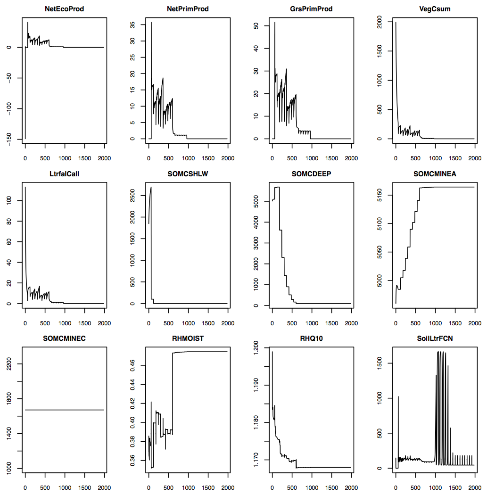
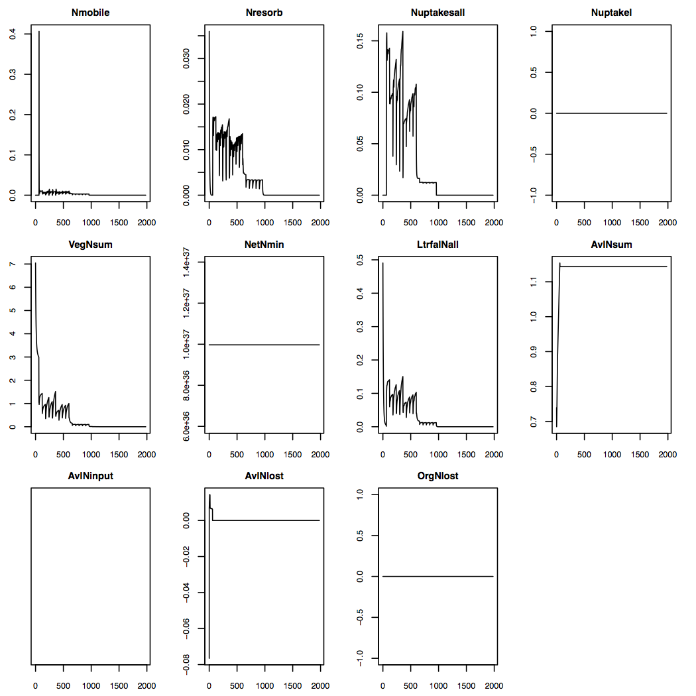
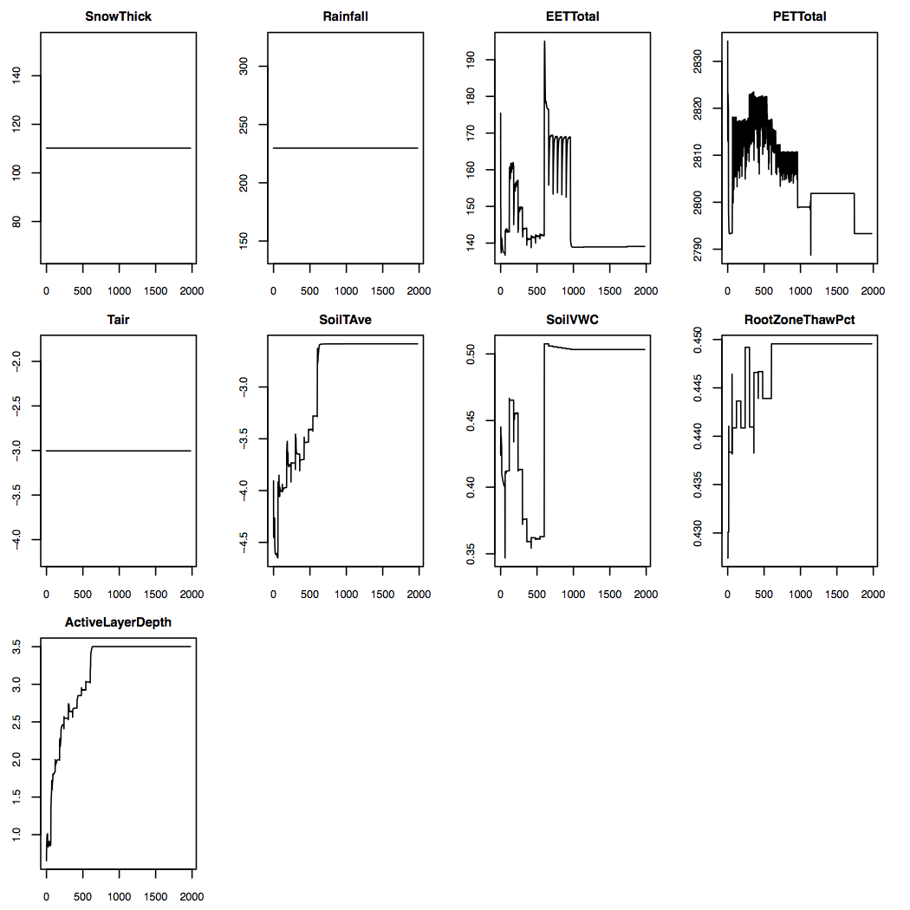
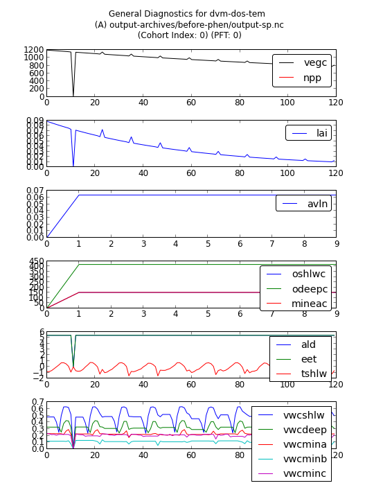
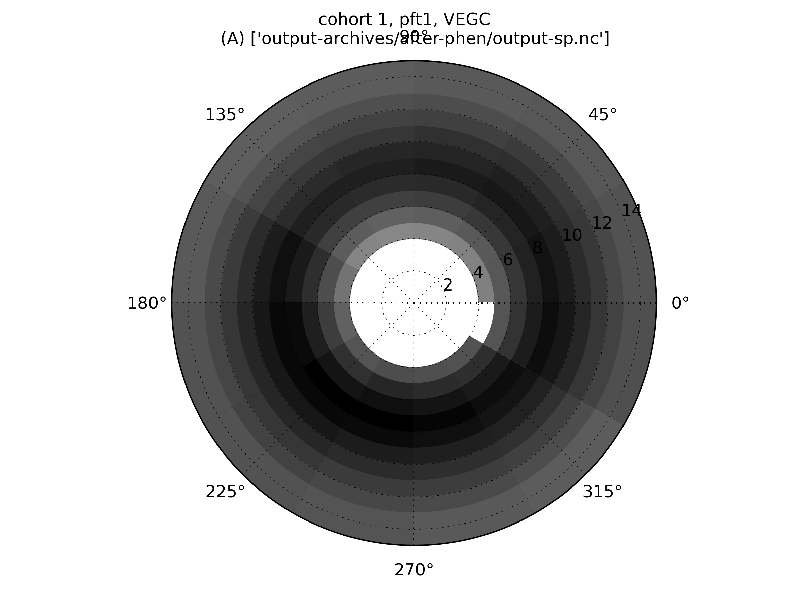
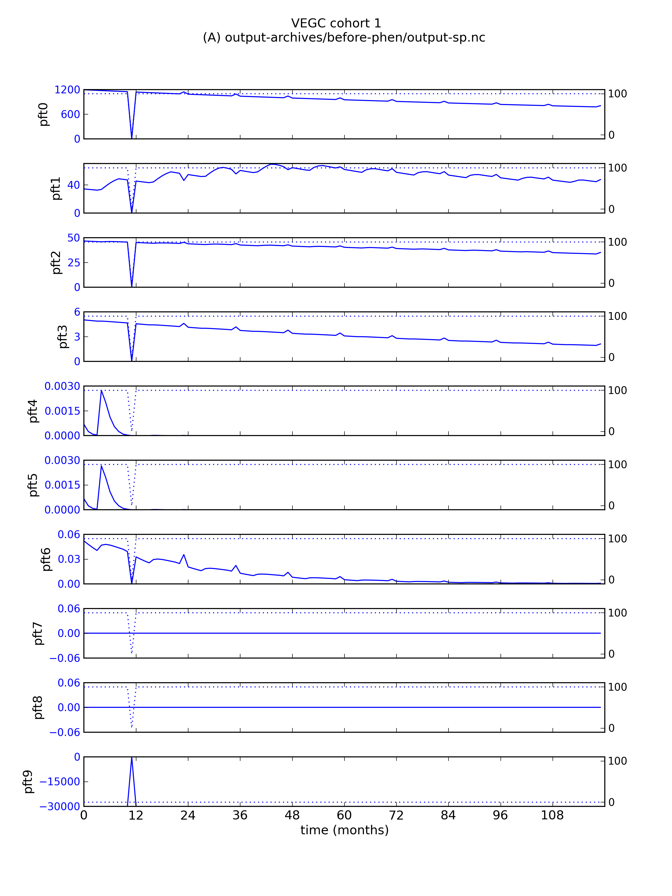
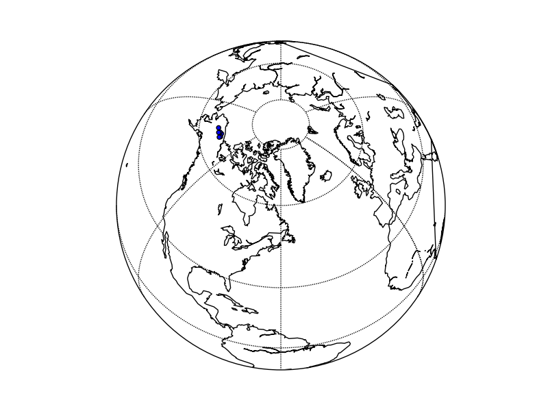
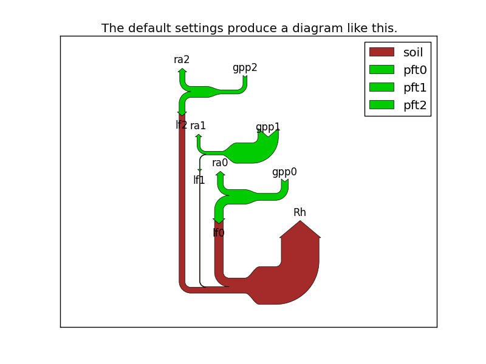

TOC
=====

[Requirements](https://github.com/tobeycarman/ddtv#Requirements)
[Examples](https://github.com/tobeycarman/ddtv#Examples)

ddtv
====

A set of scripts for visualizing data for/from the dvm-dos-tem ecosystem model.

Each script has some decent help with the --help flag.

Requirements
------------

(Python scripts) I am not certain that all of these are necessary, but this is the envrionment 
I have:

    $ pip freeze
    GDAL==1.9.1
    PyMySQL==0.5
    basemap==1.0.6
    distribute==0.6.34
    git-remote-helpers==0.1.0
    ipython==0.13.1
    matplotlib==1.2.0
    netCDF4==1.0.2
    numpy==1.6.2
    pandas==0.10.1
    python-dateutil==2.1
    pytz==2012j
    scipy==0.11.0
    six==1.2.0
    virtualenv==1.8.4
    wsgiref==0.1.2
    yolk==0.4.3
    
(R scripts) Again, this is my environment, not sure what other verisons may work

* R, v3.0.0
* ncdf4
* argparse (which requires python 2.7 I think?) 

Examples
------------

These are really rough. I have not had time to clean up the plots, or deal with
labeling the axes, titles, etc., but this should give an idea of what the scripts
can generate.

### output-extract.R and plotting-output.R

There are designed to work with ouputs from a single site run. I have not 
tested anything but the yearly timestep and the 'eq' run stage.
 
First: 

    $ ./output-extract.R --help
    Loading required package: proto
    usage: ./output-extract.R [-h] --nc-files-dir PATH
                              [--generated-files-dir DIRNAME]
                              [--run-mode M [M ...]] [--timestep T [T ...]]

    Reads a bunch of cmt***_***-**.nc files that are generated by a run of dvm-
    dos-tem in single site mode and generates csv files for the specified
    variables.

    optional arguments:
      -h, --help            show this help message and exit
      --nc-files-dir PATH   A path (relative or absolute) to a folder containing
                            some cmt***_***-**.nc files.
      --generated-files-dir DIRNAME
                            Name of directory for storing the generated file(s)
                            Defaults to making a subdirectory withing the nc-
                            files-dir named "output-extract-generated-files"
      --run-mode M [M ...]  Which run mode(s) you are processing. (default: eq)
      --timestep T [T ...]  Which timestep you are processing. (default: yearly)

And then:

    $ ./plotting-output.R --help
    Loading required package: proto
    usage: ./plotting-output.R [-h] --generated-csv-dir PATH [--output-id ID]

    This script reads a whole bunch of csv files that werte generated with output-
    extract.R. This script plots the variables and places the resulting plots in a
    folder (identified by the "--output-id" option).

    optional arguments:
      -h, --help            show this help message and exit
      --generated-csv-dir PATH
                            A path (absolute or relative) to a directory of csv
                            files that were generated using output-extract.R.
      --output-id ID        A unique name to indentify this set of generated plots
                            (pdfs) All the generated plots will end up in a folder
                            with this name in the current directory (wherever you
                            call this script from).

Examples: 

C Plot 
 

N Plot 
 

Env Variable Plot 
 

### plot_general_diagnostics.py

Looks like this only deals with outputs from the multi site run?

    $ ./plot_general_diagnostics.py --help
    usage: plot_general_diagnostics.py [-h] [-ls] [-d] [-s] [-cix N] [-p N]
                                       [--compare COMPARE]
                                       inputfile

    Make a generally useful selection of plots...

    positional arguments:
      inputfile             path to a NetCDF file (A) to read from.

    optional arguments:
      -h, --help            show this help message and exit
      -ls, --list           List the cohorts and PFTs in this file and then exit.
      -d, --display         Display the plot
      -s, --save            Save the plot with generic name. Warning: will
                            overwrite existing file with same name!!
      -cix N, --cohortindex N
                            The *index* of the cohort to plot. NOTE: this may or
                            may not be the same as the COHORTID!
      -p N, --pft N         Which PFT to plot
      --compare COMPARE     path to a NetCDF file (B) to compare.
      
Example of file list function (obvisously something is tweaked with my output 
files as it looks like there are 6 cohorts in the file that are all the same!):

    ./plot_general_diagnostics.py -ls output-archives/before-phen/output-sp.nc \
                                  --compare output-archives/after-phen/output-tr.nc
    Loading dataset(s)...
    Summary
    -----------------------------------
    (A): output-archives/before-phen/output-sp.nc
      Available CHTIDs:  6 6 6 6 6 6
      # of PFTs (zero indexed):  10
      length of YYYYMM:  120

    (B): output-archives/after-phen/output-tr.nc
      Available CHTIDs:  6 6 6 6 6 6
      # of PFTs (zero indexed):  10
      length of YYYYMM:  1272

    -----------------------------------

Example of plotting call:

    ./plot_general_diagnostics.py --save \
                                  --pft 0 \
                                  --cohortindex 0 \
                                  output-archives/before-phen/output-sp.nc
                                  

                                 

### heatmap_year_vs_month.py

    ./heatmap_year_vs_month.py --help
    usage: heatmap_year_vs_month.py [-h] [-d] [-s SAVE] [-m {rect,polar}] -c
                                    COHORT [-v VARIABLE] [-pft PFT]
                                    [--compare COMPARE [COMPARE ...]]
                                    inputfiles [inputfiles ...]

    Makes a heatmap for a single variable, and a single PFT. The heatmap is a time
    vs. time heatmap with years on the vertical axis and months on the horizontal
    axis. The color of each pixel in this grid corresponds to the variables value
    at that month, and year. A similar to the example here: http://stat-
    computing.org/dataexpo/2009/posters/wicklin-allison.pdf

    positional arguments:
      inputfiles            path to one or more NetCDF file(s) to read from (A).

    optional arguments:
      -h, --help            show this help message and exit
      -d, --display         Display the plot
      -s SAVE, --save SAVE  Save the plot to the file name you provide
      -m {rect,polar}, --mode {rect,polar}
                            Whether to use rectangular or polar coords
      -c COHORT, --cohort COHORT
                            Which cohort to plot
      -v VARIABLE, --variable VARIABLE
                            Which variable to plot
      -pft PFT              Which PFT to display data for.
      --compare COMPARE [COMPARE ...]
                            path to one or more NetCDF file(s) to compare to (B).

Call: 

    $ ./heatmap_year_vs_month.py -s "examples/hm-rect1.png" \
                                 -m rect \
                                 -c 1 \
                                 -pft 1 \
                                 -v VEGC \
                                 output-archives/after-phen/output-tr.nc

Call:

    $ ./heatmap_year_vs_month.py -s "examples/hm-polar1.png" \
                                 -m polar \
                                 -c 1 \
                                 -pft 1 \
                                 -v VEGC \
                                 output-archives/after-phen/output-sp.nc

### plot_pft_variable_mly.py

    $ ./plot_pft_variable_mly.py --help
    usage: plot_pft_variable_mly.py [-h] [-n | -e] [-d] [-s SAVE] -c COHORT
                                    [-v VARIABLE] [--compare COMPARE]
                                    inputfile
                                    
    Plots a variable vs. time for  
    each PFT in a cohort (left axis). The right axis plots the PFT's percent 
    coverage. If there are 10 PFTs, there will be 10 plots generated.

    There are two modes: "normal" and "explorer".

    In "normal" mode, the min and max for each plot are determined by the min and 
    max among all PFTs. In "explorer" mode, the y axis of each PFT plot will auto-
    scale to the range for only that PFT.

    Plots like this (not showing right y axis and coverage for clarity):

             cohort x, variable

          ^                 x xx
    PFT1  |    x x         x x  x    xxx>
          |   x   x    x  x      x xx
          |  x     xxxx xx        x
          +-x----------------------------->
                     time (months)

          ^                 x xx
          |    x x         x x  x
    PFT2  |   x   x    x  x      x xx
          |  x     xxxx xx        x  xx >
          +-x--------------------------x-->
                     time (months)
     .
     .

          ^      xxx xxx    x xx
    PFTn  |    xx   x   x  x x  x    xxx>
          |   x          xx      x xx
          |  x                    x
          +-x----------------------------->
                     time (months)

    Link to continue working on ascii representation of plots:
    http://www.asciiflow.com/#Draw1054136659174578755/54679995

    positional arguments:
      inputfile             path to a NetCDF file to read from (A).

    optional arguments:
      -h, --help            show this help message and exit
      -n, --normal
      -e, --explorer
      -d, --display         Display the plot
      -s SAVE, --save SAVE  Save the plot to simple-plot.png
      -c COHORT, --cohort COHORT
                            Which cohort to plot
      -v VARIABLE, --variable VARIABLE
                            Which variable to plot
      --compare COMPARE     path to a NetCDF file to compare to (B).

Call:

    $ ./plot_pft_variable_mly.py --explorer \
                                 -s "examples/plot_pft_var1.png" 
                                 --cohort 1 \
                                 --variable VEGC \
                                 output-archives/before-phen/output-sp.nc
                                 

### map_cohort_locations.py

    $ ./map_cohort_locations.py --help
    usage: map_cohort_locations.py [-h] [-d] [-s SAVE] -c COHORTID -g GRIDID

    Displays a dot on a map for each cohort's location. Looks ok for a few cohorts
    in Alaska, but nothing has been done to automatically format things like
    choosing the best projection.

    optional arguments:
      -h, --help            show this help message and exit
      -d, --display         Display the plot
      -s SAVE, --save SAVE  Save the plot to simple-plot.png
      -c COHORTID, --cohortid COHORTID
                            A cohortid.nc file with cohort list.
      -g GRIDID, --gridid GRIDID
                            A grid.nc file that maps cohort ids to lat/lons

Call

    $ ./map_cohort_locations.py --display \
                                -c ../dvm-dos-tem/DATA/test_06_cohorts/datacht/cohortid.nc \
                                -g ../dvm-dos-tem/DATA/test_06_cohorts/datagrid/grid.nc

### Sankey Diagrams !? 

Maybe good for representing fluxes??

This is an experiment...I think this might be useful, but I have not made it
plot real data yet...Not even sure if the concept is right? Are these
appropriate variables??

    $ ./sankeyA.py
    

